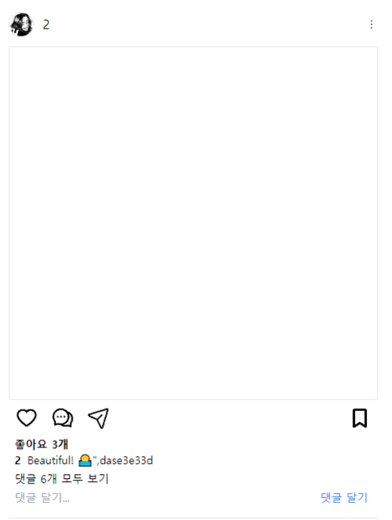

# 인스타그램 클론 코딩 With React

## 과제 개요

FrontEnd와 BackEnd를 분리해서 개발 후 연결하는 것이 목표

## 개발 기간

- 개발 기간: 2024-04-14 ~ 2024-04-21
- 버그 픽스: 2024-04-23 ~
- 데드라인: ~ 2024-04-20

## 참여 인원

|                   Frontend                   |
| :------------------------------------------: |
|                    최홍석                    |
| [@k-redstone](https://github.com/k-redstone) |

## 실행 환경

- Node : 20.12.0
- React : 18.2.0

## TECH

- Bundler  
  

- Library  
     
    
  React-modal / React-icons
- Style  
  

- 전역 상태 관리  
  zustand
- Build  
  

## 배포 사이트

https://instagram-amber-ten.vercel.app/

## 사용 방법

```javascript
npm i
npm run dev
```

## Git Message Template

```bash
git config --global commit.template <.gitmessage.txt 경로>
```

## 주요 기능들

- 좋아요



- 댓글작성


- 상세 프로필페이지


- 로그인


## Why use this Library?

### zustand

로그인 성공시 토큰값을 저장하고 거의 모든 기능에 토큰을 넣어서 요청을 보내줘야 했다.  
 props로 계속 넘겨주기에는 불필요해 보였기 때문에 전역 상태관리가 필요했었다. 가장 유명한 것은 redux였지만 Store을 만들고 action을 만들고 어쩌구 저쩌구하기에 필요한 코드가 너무 많았다.  
 관리할 값이 2~3개 밖에 없었기 때문에 간단한 Zustand를 사용하기로 결정했다.  
 적용해 봤을 때 코드의 수도 줄었고, 간단하게 전역 상태관리가 가능해졌다. 특히 러닝커브가 낮았다.

### react-hook-form

지금까지 form데이터는 직접 js로 보내본 경험 밖에 없었다. 지금 까지 경험으로는 js에서 넘어온 데이터를 유효성 검사 및 요청을 보내고 리턴값으로 어떻게 렌더를 할지 정하는 이 과정이 복잡했다.  
 React-Hook-Form은 필드의 유효성 검사와 에러 시 보여줄 메시지를 설정하여 바로 보여줄 수 있었는데, 유효성 검사 부분은 제대로 써보진 않았지만, 따로 함수로 만들어 뺄 수 있는 점에서 쉽게 커스터마이징이 가능해 보였다.

### react-modal

모달창을 직접 만들고 싶었지만, 바닐라에서도 만들어본적 없는걸 react에서 만들기에는 어려웠다....
부모의 상태도 받아와야하고, 모달 바깥쪽을 눌렀을 때 꺼지는 것도 어떻게 이벤트 분기처리를 할지 떠오르지 않았다. 뭔가 삽질을 하면 완성될 것 같았지만, 프로젝트가 너무 커진 상태에서 제작하고 적용하기에는 오래걸릴 것 같기 때문에 라이브러리를 사용했다.  
React-Modal은 on/off 상태에 따라 쉽게 껏다 킬수 있었고, Modal창이 꺼질 때 특정 함수를 불러와 원하는 동작을 실행 시킬 수 있었다. 다만 overlay와 content부분의 디자인을 jsx로 작성을 해주었는데 tailwind로 디자인 하던 컴포넌트와 코드가 일치 하지 않아 아쉬운 점이 있다.

## React로 개발하면서 아쉬웠던 점 및 알게된 점

### 배운점

- useEffectLayout
  - 데이터를 받아온 후에 렌더링 하는 경우가 많았는데, 이때 오류가 가장 많이 발생 했다. 특히 render limit과 데이터가 객체값이다 보니 property를 못가져와서 Render 오류가 발생하는 경우가 많았다. 이것을 해결하고자 useEffectLayout을 도입하고자 했다.
- 생명주기
  - useEffect는 컴포넌트가 render와 paint가 된 후에 실행되고 비동기적으로 작동한다.
  - useEffectLayout는 컴포넌트가 render된후 실행되고, 동기적으로 작동한다.

### 아쉬웠던 점

- React의 생명주기에 대해 다시 공부가 필요해보인다.
  - render와 paint, useEffect가 어떻게 실행되는지 공부 필수
  - 특히 데이터 fetch를 해오고 paint를 해야하는데, fetch가 useEffect에서 실행되다 보니 데이터가 객체이면 무조건 조건부 렌더링을 사용할 수 밖에 없다. 이거에 대한 좋은 대안이 없을까? 물론 state의 초기값을 상세히 작성하면 문제가 없을 것 같지만 좀...
